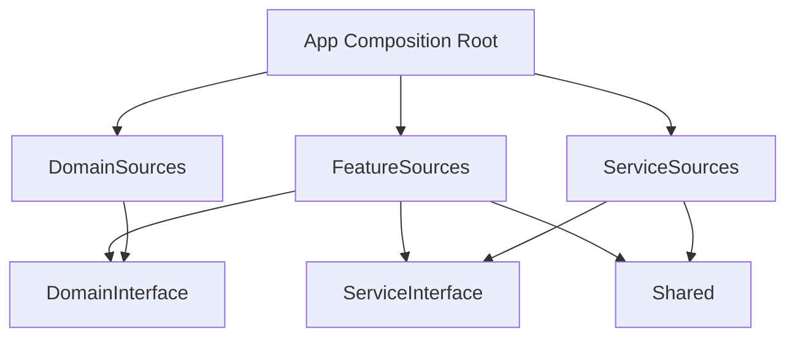

# TmaTemplates – Tuist Modular Architecture Plugin

TMA는 **The Composable Architecture (TCA)**를 사용하는 iOS 프로젝트를 위한 전문 Tuist 플러그인입니다. `tuist scaffold` 한 번으로 Feature, Service, Domain, Shared 모듈을 동일한 규칙과 테스트 기반으로 생성하며, 현대적인 iOS 개발 워크플로우에 최적화된 구조를 제공합니다.

---

## 📖 핵심 철학 및 원칙 (Core Principles)

TMA는 **μFeatures(Micro-Features)** 아키텍처와 **TCA 공식 패턴**을 결합하여 대규모 프로젝트에서도 유지보수 가능한 구조를 지향합니다.

- **일관된 타겟 구조**: 
    - **Domain/Service**: 2-target (Interface + Sources). 
    - **Feature**: 2-target (Feature + Tests). 
    - **Shared**: 1-target (Internal logical separation).
- **TCA 공식 관리 패턴**: `TestDependencyKey`는 Interface에, `liveValue`는 App Composition Root에서 주입하여 의존성을 철저히 분리합니다.
- **Portability (Self-contained)**: 모든 템플릿은 독립적입니다. 외부 Helper 유틸리티 없이 각 `Project.swift` 내에 설정이 완결적으로 포함되어 있어 높은 휴대성을 가집니다.
- **Swift 6 Readiness**: 전 모듈에 대해 Swift 6의 Concurrency 모델을 준수하도록 기본 설정되어 있습니다.

---

## 🛠️ 요구 사항 및 설치 (Setup)

### 요구 사항
- **Tuist 4.119.1 이상** (Xcode 16 `buildableFolders` 기능 필수)
- **Xcode 16.0 이상**
- **iOS 15.0 이상** (기본 Deployment Target)

### 설치 방법
`Tuist.swift` (프로젝트 루트)에 플러그인을 등록합니다.

```swift
import ProjectDescription

let tuist = Tuist(
    plugins: [
        .git(url: "https://github.com/axiom-orient/TmaTemplates", tag: "2.0.0")
    ]
)
```

이후 터미널에서 `tuist install`을 실행하여 플러그인을 활성화합니다.

---

## 🚀 빠른 시작 (Quick Start)

### 1. 외부 의존성 관리
`Tuist/Package.swift`에 라이브러리를 정의하고 `tuist install`을 통해 동기화합니다. `Dependencies.swift`는 더 이상 사용하지 않습니다.

### 2. 모듈 생성 명령어
명령어 한 줄로 아키텍처 가이드라인에 맞는 모듈을 즉시 스캐폴딩할 수 있습니다.

| 템플릿 | 용도 | 명령어 예시 |
| :--- | :--- | :--- |
| **Feature** | UI 스크린 및 비즈니스 로직 | `tuist scaffold feature --name Home` |
| **Domain** | 순수 비즈니스 로직 및 모델 | `tuist scaffold domain --name User` |
| **Service** | 앱 외부 시스템 경계 (API 등) | `tuist scaffold service --name Auth` |
| **Shared** | 공용 유틸리티, 디자인 시스템 | `tuist scaffold shared --name UIComponents` |

---

## 🏛️ 아키텍처 상세 설계 (Architecture Deep Dive)

### 1. 모듈별 타겟 상세

| 모듈 유형 | 타겟 구성 | 종속성 규칙 |
| :--- | :--- | :--- |
| **Feature** | Feature, Tests | Domain, Service, Shared |
| **Domain** | Interface, Sources | Foundation, Dependencies |
| **Service** | Interface, Sources, Tests | Interface, Shared |
| **Shared** | Sources (Internal organization) | Foundation |

> [!TIP]
> **권장 Import 패턴**: 가능한 한 `Interface`만 import 하세요 (예: `import UserDomainInterface`). 구체적인 구현체(`Sources`)는 App 타겟에서만 링크됩니다.

### 2. 의존성 규칙 (Dependency Rules)



- ✅ **GOOD**: `Interface`만 Import (예: `import UserDomainInterface`).
- ❌ **BAD**: `Sources` 직접 Import (예: `import UserDomainSources`).
- **Composition Root**: 오직 `App` 타겟만이 실체 구현체(`Sources`)를 알고 연결합니다.

---

## 📦 공용 모듈 가이드 (Shared Modules Guide)

Shared 모듈은 디자인 시스템이나 유틸리티 등 모든 레이어에서 공통으로 사용하는 기능을 제공합니다.

### 1. SharedCore (Infrastructure)

`tuist scaffold shared --name SharedCore` 명령으로 생성되며, 다음 컴포넌트를 포함합니다.

#### NetworkMonitor
Actor 기반의 네트워크 상태 모니터링 유틸리티입니다.

```swift
// Interface
public protocol NetworkMonitoring: Sendable {
    var status: NetworkStatus { get async }
    func start() async
}

// Usage in Feature
@Dependency(\.networkMonitor) var networkMonitor
// ...
await networkMonitor.start()
```

#### KeychainStorage
안전한 데이터 저장을 위한 Actor 기반 래퍼입니다.

```swift
// Interface
public protocol SecureStoring: Sendable {
    func save<T: Codable>(_ value: T, forKey key: String) async throws
    func load<T: Codable>(forKey key: String, as type: T.Type) async throws -> T?
}

// Usage
@Dependency(\.secureStorage) var secureStorage
try await secureStorage.save("token123", forKey: "authToken")
```

### 2. DesignSystem (UI)

`tuist scaffold shared --name DesignSystem` 명령으로 생성합니다.

#### ColorToken & Theme
시맨틱 컬러와 테마 시스템을 제공합니다.

```swift
// Usage
@Dependency(\.themeProvider) var theme
Text("Hello").foregroundStyle(theme.token(for: .textPrimary).swiftUIColor)
```

---

## 💡 개발 가이드라인 및 베스트 프랙티스

### 1. Xcode 16 `buildableFolders` 활용
Tuist 4.62.0부터 지원되는 파일 시스템 동기화 기능을 적극 활용합니다. 파일 추가/삭제 시 `tuist generate`를 매번 실행할 필요가 없어 AI 도우미와의 협업에 최적화되어 있습니다.

### 2. TCA Linking 일관성
기본적으로 모든 모듈을 `.staticFramework`로 유지하세요. 중복 심볼 오류가 발생할 경우에만 예외적으로 전체 모듈을 `.framework`로 전환하는 것을 검토합니다.

### 3. CI/CD 및 보안
- GitHub Actions 사용 시 `TUIST_TOKEN` 노출 대신 **OIDC 인증**을 연동하세요.
- CI 환경에서는 `tuist install --force-resolved-versions`를 사용하여 빌드 결정론을 확보합니다.

---

## 📋 검증 체크리스트

새로운 버전을 배포하거나 모듈을 추가할 때 다음을 확인하세요:
1.  `tuist scaffold` 명령어가 에러 없이 완료되는가?
2.  생성된 모듈의 `Project.swift`가 `tuist edit`에서 유효한가?
3.  Swift 6 Strict Concurrency 경고가 없는가?

---

## 라이선스
이 프로젝트는 [MIT License](LICENSE)를 따릅니다.