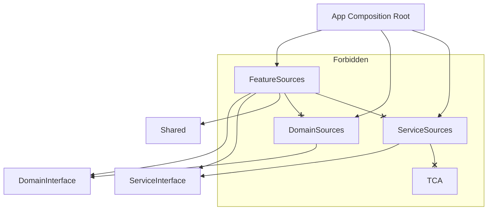

# TMA Module Scaffolding & Architecture Guide

**Project**: awesomeApp
**Organization**: axient
**Generated**: 

---

## 📖 Overview

This guide serves as the **single source of truth** for creating and implementing modules in the TMA (Tuist Modular Architecture) project. It combines scaffolding commands (`tuist scaffold`) with architectural rules for using **The Composable Architecture (TCA)**, **Swift Dependencies**, and **Swift Sharing**.

---

## 🏗️ Module Types & Implementation Rules

### 1. Domain (Business Logic)

**Purpose**: Pure business logic, use cases, and entities.
**Libraries**: `swift-dependencies` (Interface), `Foundation`.
**Forbidden**: `TCA` (Keep domain logic framework-agnostic).

#### Scaffolding
```bash
tuist scaffold domain --name {Name} --organization-name axient --bundle-id-prefix com.axiomorient
```

#### 🧑‍💻 Implementation Guide (swift-dependencies)
**Goal**: Define the contract (Interface) and provide a test double.

**1. Define Interface (`Projects/Domains/{Name}/Interface/{Name}UseCase.swift`)**
```swift
import Dependencies

public protocol ProductUseCase: Sendable {
    func fetchAll() async throws -> [Product]
}

// ✅ ALWAYS define TestDependencyKey in Interface
public enum ProductUseCaseKey: TestDependencyKey {
    public static let testValue: any ProductUseCase = UnimplementedProductUseCase()
}

public extension DependencyValues {
    var productUseCase: any ProductUseCase {
        get { self[ProductUseCaseKey.self] }
        set { self[ProductUseCaseKey.self] = newValue }
    }
}
```

**2. Implement Logic (`Projects/Domains/{Name}/Sources/Default{Name}UseCase.swift`)**
```swift
public final class DefaultProductUseCase: ProductUseCase {
    public func fetchAll() async throws -> [Product] { ... }
}
```

---

### 2. Service (Infrastructure)

**Purpose**: External systems (API, Database, Bluetooth).
**Libraries**: `swift-dependencies` (Interface), `GRDB`/`Alamofire` (Implementation).
**Forbidden**: `TCA`. Services must be pure Swift Actors or Classes.

#### Scaffolding
```bash
tuist scaffold service --name {Name} --organization-name axient --bundle-id-prefix com.axiomorient
```

#### 🧑‍💻 Implementation Guide
**Goal**: Isolate side-effects.

**1. Interface (`Projects/Services/{Name}/Interface`)**
SAME as Domain. Define Protocol + TestDependencyKey.

**2. Implementation (`Projects/Services/{Name}/Sources`)**
```swift
// ✅ use 'actor' for thread-safe state (e.g. database connection)
public actor LiveDatabaseService: DatabaseService {
    public func save(_ item: Item) async throws { ... }
}

// ⚠️ IMPORTANT: Avoid @Table Macro
// The @Table macro from swift-sqlite-data can cause build issues.
// Use explicit GRDB conformance instead:
public struct ItemRecord: Codable, FetchableRecord, PersistableRecord, TableRecord, Sendable {
    public static let databaseTableName = "items"
    
    public var id: UUID
    public var name: String
    
    // Explicit CodingKeys for snake_case mapping
    enum CodingKeys: String, CodingKey {
        case id
        case name
    }
}

```

---

### 3. Feature (UI & User Flows)

**Purpose**: Screens, Navigation, User Interaction.
**Libraries**: `swift-composable-architecture` (TCA).

#### Scaffolding
```bash
tuist scaffold feature --name {Name} --organization-name axient --bundle-id-prefix com.axiomorient
```

#### 🧑‍💻 Implementation Guide (TCA)

**1. Reducer (`Projects/Features/{Name}/Sources/{Name}Feature.swift`)**
```swift
import ComposableArchitecture

@Reducer
public struct ProductListFeature {
    @ObservableState
    public struct State: Equatable {
        var products: [Product] = []
    }
    
    public enum Action: Sendable {
        case onAppear
    }
    
    // ✅ Inject Dependencies (defined in Domain/Service Interface)
    @Dependency(\.productUseCase) var productUseCase
    
    public var body: some ReducerOf<Self> {
        Reduce { state, action in
            switch action {
            case .onAppear:
                return .run { send in
                    // Call Domain Logic
                     let products = try await productUseCase.fetchAll()
                }
            }
        }
    }
}
```

**2. Shared State (`swift-sharing`)**
If multiple features need the same state (e.g., User Settings), use `@Shared`.

```swift
@Reducer
struct UserSettings {
    @ObservableState
    struct State: Equatable {
        // ✅ State is shared across features & persisted
        @Shared(.appStorage("user_theme")) var theme = "light"
    }
    
    // ...
    // $theme.withLock { $0 = "dark" }
}
```

---

### 4. Shared (Utilities & Core)

**Purpose**: Reusable components (Design System, Extensions).
**Libraries**: `swift-sharing` (AppState), `Foundation`.

#### Scaffolding
```bash
tuist scaffold shared --name {Name} --organization-name axient --bundle-id-prefix com.axiomorient
```

**Common Shared Modules**:
- `SharedCore`: Logging, DateFormatters, Extensions.
- `DesignSystem`: Color Tokens, Typography, UI Components.

---

## 🔌 DI Wiring (App Composition)

**CRITICAL**: Dependencies are defined in `Interface` but **linked** in `App`.

**File**: `Projects/App/Sources/Dependencies/AppComposition.swift`

```swift
import Dependencies
import ProductDomain // Contains DefaultProductUseCase
import DataService   // Contains LiveDataService

public struct AppComposition {
    public static func configureAll() {
        // ✅ Register LIVE implementations here
        DependencyValues.live.productUseCase = DefaultProductUseCase()
        DependencyValues.live.databaseService = LiveDatabaseService()
    }
}
```

> **Why?** This keeps Modules decoupled. A Feature module never imports `DomainSources` or `ServiceSources`, only `Interfaces`.

---

## 📊 Dependency Rules Reference



| Type | Can Import? | Must Implement? |
| :--- | :--- | :--- |
| **Interface** | `Dependencies` | `TestDependencyKey` (`testValue`) |
| **Sources** | `Interface` | Protocol Implementation |
| **Feature** | `Interface`, `TCA` | `Reducer`, `View` |
| **App** | `Sources` (All) | `DependencyKey` (`liveValue`) |

---

## 🧪 Testing Strategy

1.  **Feature Tests**:
    -   Use `TestStore` from TCA.
    -   Dependencies are automatically mocked (via `testValue`).
    
2.  **Domain/Service Tests**:
    -   Test the Logic/Implementation in isolation.
    -   Unit tests for `Sources`.

---

**Happy Scaffolding!** 🚀
